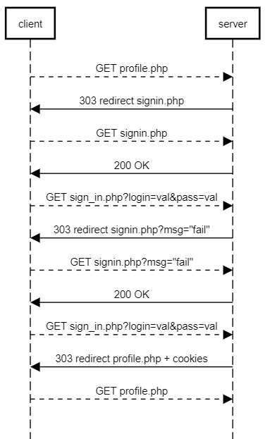
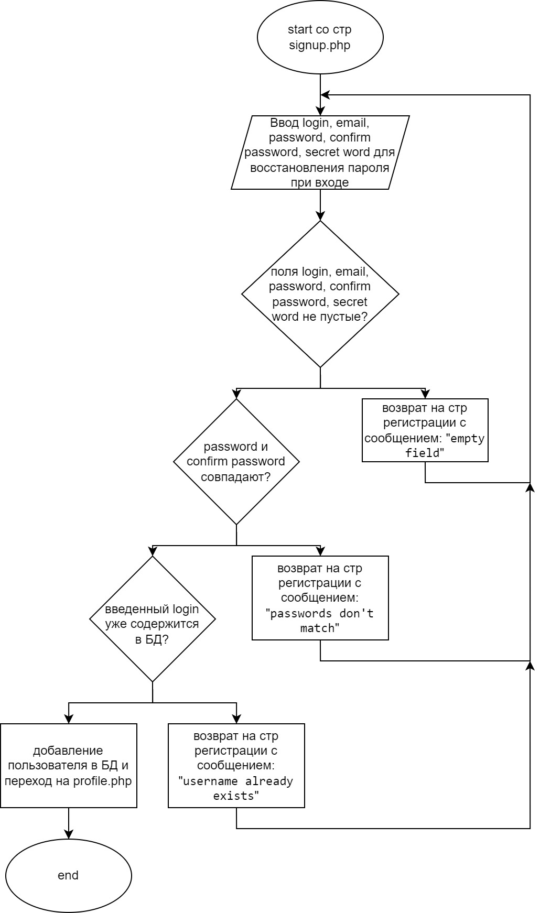
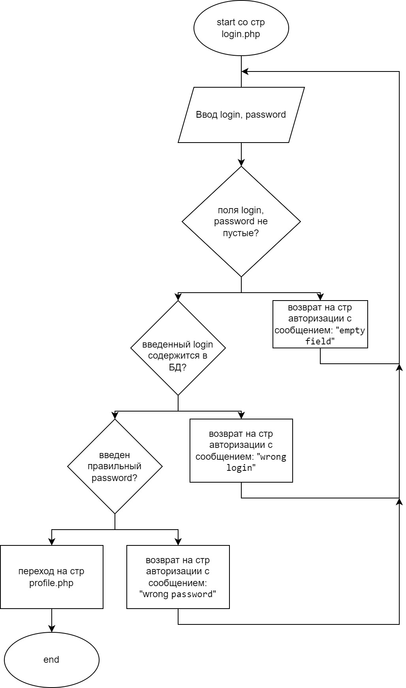
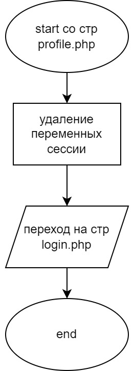
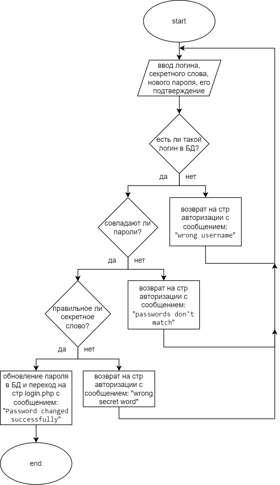

# HTTP аутентификация

## Текст задания
### Цель работы
Спроектировать и разработать систему авторизации пользователей на протоколе HTTP

## Ход работы
1) [Пользовательский интерфейс](https://www.figma.com/file/hSWGqjHNCLkkSetXraLjx5/IS_lr_1)

//
Первоначально пользователь попадает на форму входа (sign-in.php). Затем, если у него есть аккаунт, то он вводит логин и пароль и входит в свой аккаунт, нажав кнопку “sing in”. В случае корректного ввода пользователь перенаправляется на главную страницу (index.php). Если же он ввел что-то неправильно, то возвращается на эту же страницу, но вверху будет написано сообщение о его ошибке.

Если же изначально пользователь не имеет аккаунта, то он может перейти по ссылке “sign up” и зарегистрироваться. В данном случае пользователь перенаправляется на страницу регистрации (sign-up.php), где ему необходимо ввести имя, логин и пароль два раза и нажать на кнопку “sign up”. В случае корректного ввода он перенаправляется на главную страницу (index.php). Если же пользователь ввел что-то неправильно, то возвращается на эту же страницу, но вверху будет написано сообщение о его ошибке. Если пользователь случайно перешел по ссылке регистрации, то он может нажать на ссылку “already registered?”, которая вернет его обратно на форму входа.

Если же пользователь забыл пароль от уже существующего аккаунта и не может войти, находясь на форме входа, но он может перейти по ссылке “lost pass?” и изменить пароль. В данном случае пользователь перенаправляется на страницу изменения пароля (forgot_pass_form.php), где ему необходимо ввести имя, логин и пароль два раза и нажать на кнопку “change pass”. В случае корректного ввода пользователь перенаправляется на главную страницу (index.php). Если же он ввел что-то неправильно, то возвращается на эту же страницу, но вверху будет написано сообщение о его ошибке.

Когда пользователь попадает на главную страницу, то у него есть две ссылки: “exit” и “change pass”. Первая ссылка перенаправляет пользователя на форму входа, при этом он выходит из аккаунта. Вторая ссылка перенаправляет на страницу смены пароля (change_pass_form.php). На этой странице ему нужно ввести старый пароль и новый два раза и нажать на кнопку “change pass”. В случае корректного ввода пользователь перенаправляется на главную страницу (index.php) и на ней вверху отображается сообщение об успешной смене пароля. Если же он ввел что-то неправильно, то возвращается на эту же страницу, но вверху будет написано сообщение о его ошибке. Если пользователь случайно перешел по ссылке смены пароля, то он может нажать на ссылку “return”, которая вернет его обратно на главную форму.
//
2) Пользовательские сценарии работы

3) API сервера и хореография\

4) Структура БД

| id | login | email | password | secret_word |
| ------ | ------ | ------ | ------ | ------ |

- id : INT(11), PRIMARY KEY, AUTO_INCREMENT
(уникальный идентификатор пользователя)
- login : VARCHAR(250), по умолчанию NULL
(логин)
- email: VARCHAR(255), по умолчанию NULL
(почта)
pass: VARCHAR(500), по умолчанию NULL
(хешированный пароль)
- secret_word: VARCHAR(255), по умолчанию NULL
(хешированное секретное слово для восстановления пароля)

5) Алгоритмы
- регистация

- авторизация

- выход

- обновление пароля

- смена пароля

## Примеры HTTP запросов и ответов

## Значимые фрагменты кода
В репозитории представлены все исходные файлы по лабораторной
