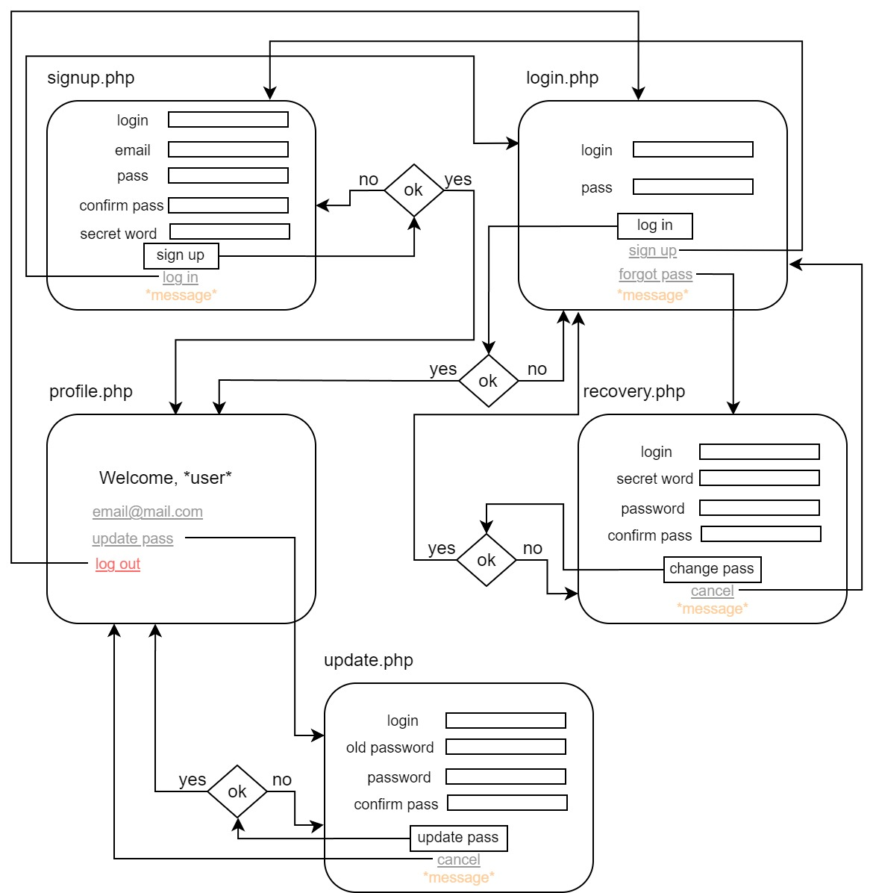

# HTTP аутентификация

## Текст задания
### Цель работы
Спроектировать и разработать систему авторизации пользователей на протоколе HTTP

## Ход работы
1) [Пользовательский интерфейс](https://www.figma.com/file/hSWGqjHNCLkkSetXraLjx5/IS_lr_1)
2) 
